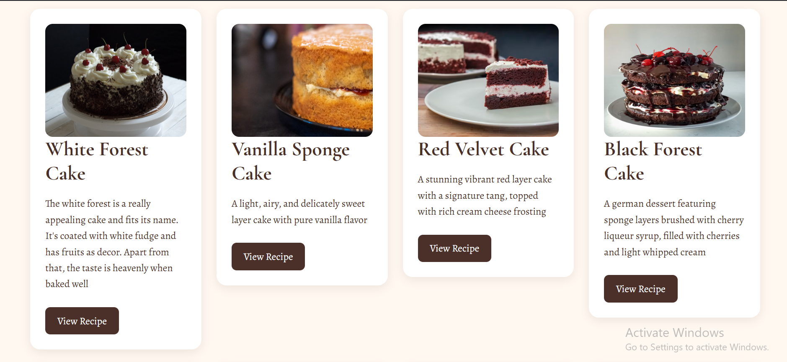
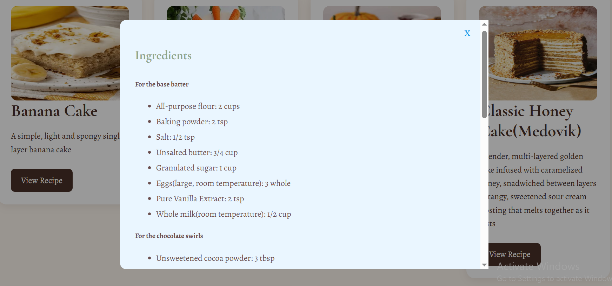
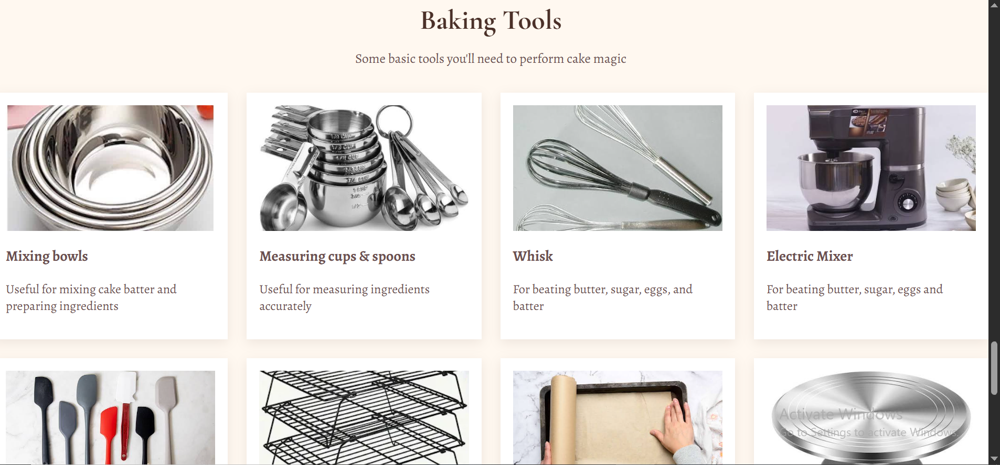

# Cake-Crumb
View here: https://cake-crumb.vercel.app/
Cake & Crumb is a simple cake recipe website I made out of my love for cakes. I wanted to create something that would make it easier for young bakers like me to find different recipes in one place. Along with recipes, the website also includes cake images, YouTube tutorial links, and a section featuring some basic tools used for baking.

## Features
- **Cake Cards** - A collection of different cake recipes with images and descriptions.
<p align="center">

</p>

- **Full Recipes** - Each cake has a recipe containing its ingredients and step-by-step instructions.
<p align="center">

</p>

- **Recipe Modals** - Users can click the "View Recipe" button to open the full recipe without leaving the page
- **YouTube Tutorials** - Recipes include links to YouTube tutorials for additional guidance
- **Baking Tools** - A dedicated section featuring basic tools used for baking cakes.
<p align="center">

</p>

- **Interactive Elements** - I used JavaScript to make the recipe modals interactive.
- **Hover effects** - There are subtle hover effects that add some movement and interaction to the recipe and baking tool cards.
- **Bakery-inspired Design** - The website uses soft colors, custom fonts, and a cozy design inspired by baking and desserts.

## Technologies Used
- HTML
- CSS
- JavaScript

## How to Run

1. Clone this repository:

      ```bash
   git clone https://github.com/Amanda101322/Cake-Crumb.git
2. Open the project folder
3. Then open index.html in your web browser

## Future Improvements
If I continue working on Cake & Crumb, I would like to add more bakery style features to it. For now, I've decided to keep the project simple and focus on making the existing recipes, baking tools and interactions work well enough to satisfy the potential users.

## Credits
The cake images and recipe resources used throughout this project come from external sources, with YouTube tutorials linked where applicable.

Made with a little cake magic